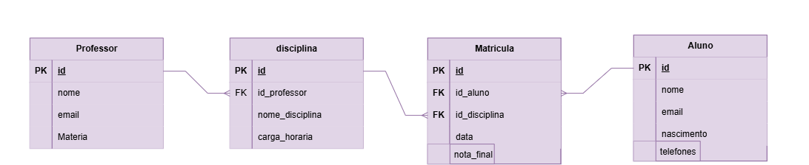
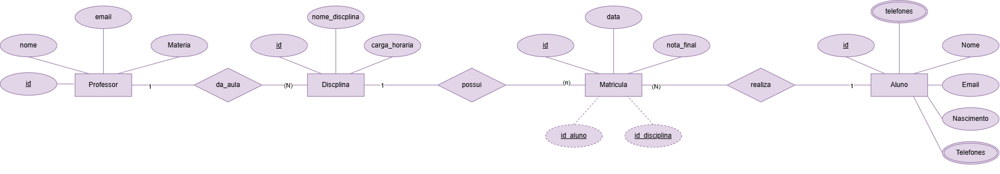

# Projeto: Gestão de Escola
--------------------------------------

--------------------------------------

## Dicionário de Dados

| Entidade | Atributo | Tipo | Tamanho | Descrição |
|-|-|-|-|-|
| Professor | id | int | 11 | Chave primária |
| Professor | nome | varchar | 100 | Nome do professor |
| Professor | email | varchar | 100 | E-mail do professor |
| Professor | Materia | varchar | 50 | Matéria ensinada pelo professor |
| Disciplina | id | int | 11 | Chave primária |
| Disciplina | id_professor | int | 11 | Chave estrangeira, referencia: Professor(id) |
| Disciplina | nome_disciplina | varchar | 100 | Nome da disciplina |
| Disciplina | carga_horaria | int | 11 | Carga horária em horas |
| Aluno | id | int | 11 | Chave primária |
| Aluno | nome | varchar | 100 | Nome completo do aluno |
| Aluno | email | varchar | 100 | E-mail do aluno |
| Aluno | nascimento | date |  | Data de nascimento do aluno |
| Aluno | telefones | varchar | 20 | Número de telefone do aluno |
| Matricula | id | int | 11 | Chave primária |
| Matricula | id_aluno | int | 11 | Chave estrangeira, referencia: Aluno(id) |
| Matricula | id_disciplina | int | 11 | Chave estrangeira, referencia: Disciplina(id) |
| Matricula | data | date |  | Data da realização da matrícula |
| Matricula | nota_final | decimal | 4,2 | Nota final do aluno na disciplina |

## Dados de teste em CSV
- [Professor.csv](professor.csv)
- [Disciplina.csv](disciplina.csv)
- [Aluno.csv](aluno.csv)
- [Matricula.csv](matricula.csv)
